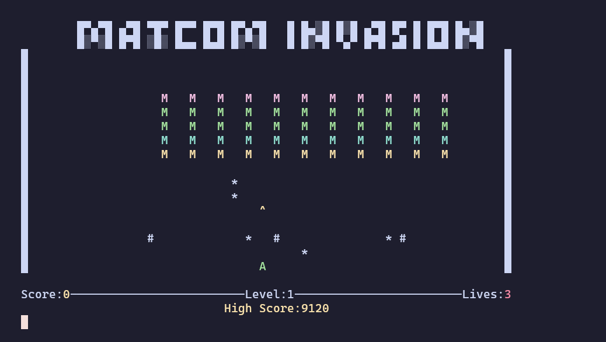

# The Game

MatCom Invasion is an action-packed arcade game where your mission is to defend the Faculty of Mathematics and Computing from an alien invasion! You control the last line of defense, piloting a ship represented by the letter `A`. Enemies `M` march down from the top of the screen, advancing row by row. Armed with your trusty laser cannon, you fire projectiles `^` to destroy the invaders before they reach the bottom of the screen.

Beware, the enemies fight back! They fire deadly projectiles `*` aimed at taking you out. Fortunately, shields `#` stand between you and the alien onslaught, but they won't last forever—each hit weakens them. Dodge enemy fire, take cover, and aim carefully to wipe out the alien forces.

Survive their attacks, destroy all enemies, and advance to the next level. But be careful—if you're hit three times, it's game over! Compete for the highest score and leave your mark on the leaderboard. Do you have what it takes to save MatCom from total invasion?



# How to play

To run *MatCom Invasion* follow these steps in a Linux enviroment:

1) Give execution permissions to the `build.sh` script by running the following command in the terminal:
    ```bash
    chmod +x build.sh
    ```

    The `build.sh` script will create an executable file named `MatComInvasion` in the `/usr/local/bin` directory, as well as a `highscore.txt` file, and will copy the `Sounds` folder.

<br>

2) Execute the `build.sh` script:
    ```bash
    ./build.sh
    ```
<br>

3) Once the build is complete, launch the game by typing:
    ```bash
    MatComInvasion
    ```

Enjoy ;) 